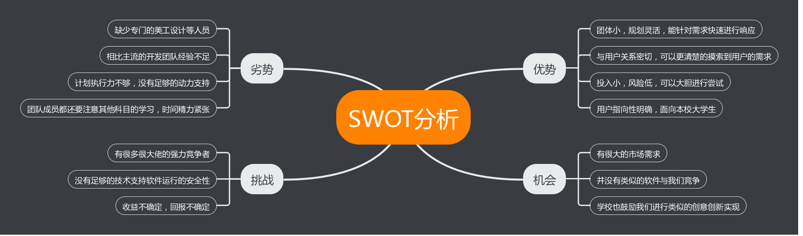

## 项目愿景

#### 项目概述

为有困难的同学提供及时的帮助，为有时间的同学提供赚钱的渠道

#### 项目背景

进入大学后，我们可以发现在微信群和朋友圈中，会经常出现同学因为课程或者毕业设计的关系，请大家帮忙填问卷或者参加测试的情况。除此之外，由于学校的一些规定和措施，或者自己时间的问题，拿外卖和取快递有时也会有一定的困难。所以我们希望为这些有困难的同学提供帮助，并为一些有空闲的同学提供挣钱的简单渠道。

#### 最具价值的业务场景

* 发问卷场景
	* 发布者发布问卷，设定份数、最晚提交时间，并支付对应的回报
	* 用户可以选择接受该任务，并回答问卷吗，按照规范回答后即可得到相应的奖励
	* 问卷截止日期后，如果没有填完足够的问卷，则回报会被退回到发布者账户的余额中
	
* 取快递场景
	* 发布者发布取快递任务，并支付对应的费用
	* 用户可以选择接受该任务，完成该任务后需要通过图片的方式向平台反馈任务完成的情况。
	* 平台审核通过后，向用户支付回报，并通知发布者

#### 项目的基本特征

* 注册和登录使用中大邮箱进行，保证用户的真实性
* 可以通过邮箱的类型来区分账户的类型
* 发布者可以发布问卷或取快递的任务
* 接收者接收任务后需要立即完成，完成后收到相应的回报

#### 亮点或创新点

* 可以利用tag，将任务推送给对应的用户，以提高任务完成的质量。如：问卷限制非心理学院学生，则任务不会推送给心理学院学生
* 利用微信小程序进行交互，不用下载额外的应用软件，操作简单便捷
* 利用邮箱进行实名制，组织账号需要向平台提交申请，增加了可靠性
* UI设计简单美观

#### 简短的竞争或趋势分析，如 SWOT分析模型，盈亏平衡点模型等

