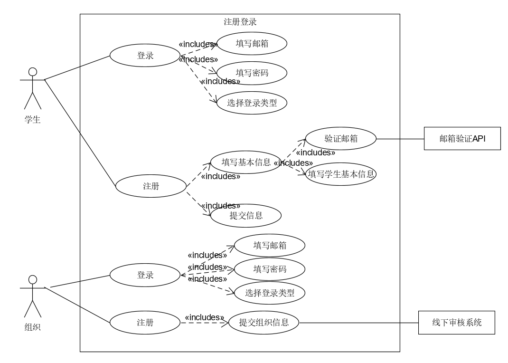
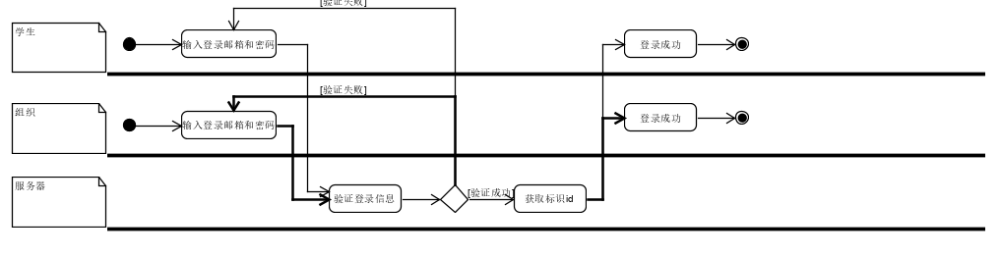
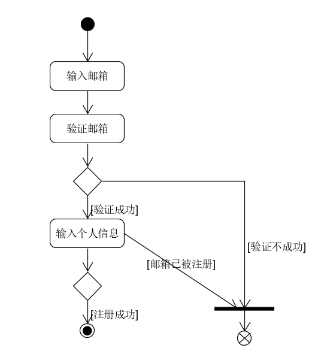
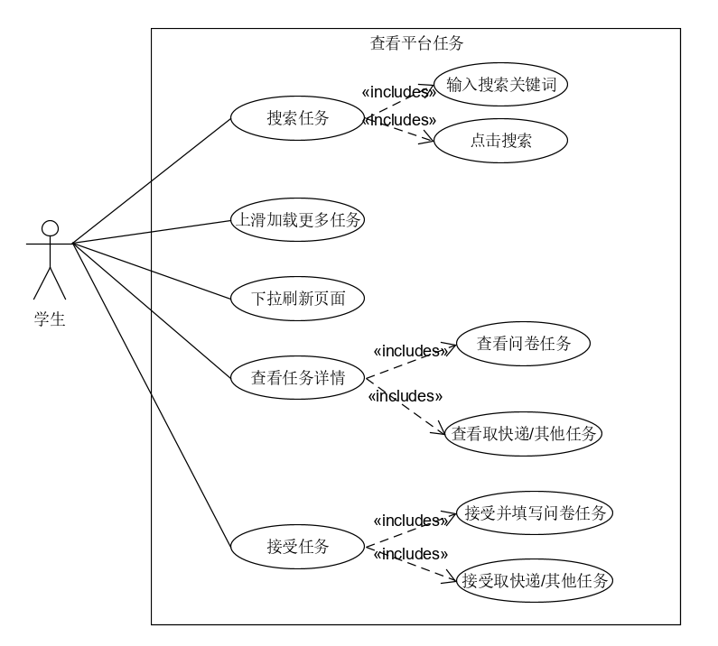
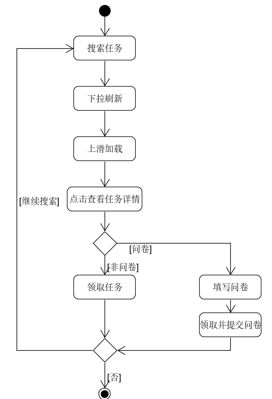
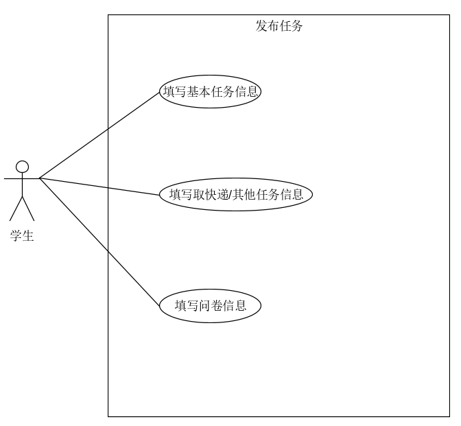
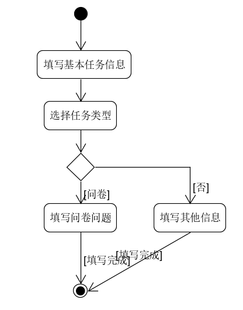
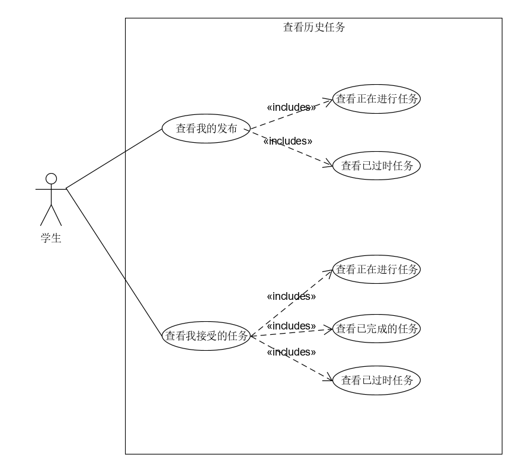
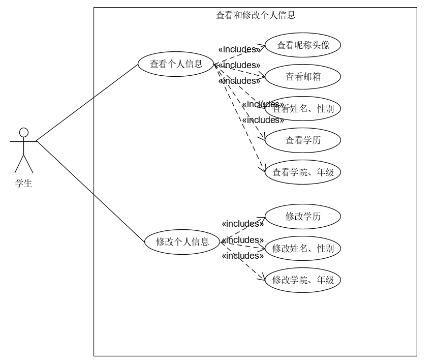

# Use Cases

## 用例的详细描述

**范围**：闲余翻身

**级别**：用户目标

**参与者**：学生

**期望**：
    
* 顾客： 希望通过此平台，能够为学生的日常校园生活带来极大的便利。问卷调查是校园信息采纳的一大重要途径，学生可以利用此平台快速便捷的填写日常有关的任务。同时作为在校学生，可发布相应的任务，如取快递等，学生也可发布一定的问卷。
* 组织：组织希望通过此平台，极大的推广问卷，并且为问卷的填写和信息收集提供便利。
* 平台：审核任务的发布以及组织申请等

**条件**： 用户的发布和接收任务必须在授权登录注册

**主成功场景（基本流程）**： 
    
1. 学生对小程序进行授权，正确输入邮箱密码，进入小程序。
2. 学生对小程序进行注册，输入对应的注册信息，完成注册后自动登录跳转到主界面。
3. 学生选择主界面中的任务，点击可查看详情，选择自己喜欢或者乐意完成的任务。
4. 学生完成任务，任务类型为问卷，在点击详情时，可直接看到问卷信息，领取任务需同时提交问卷答案；完成问卷，获得对应的报酬奖励。
5. 学生完成任务，任务类型为取快递或其他时，点击详情，可直接看到任务信息，领取任务，在规定时间内完成任务后上传任务完成凭证，完成任务，获得对应的报酬。
6. 学生完成任务，在我界面中可看到自己完成任务和发布任务的情况。
7. 学生在我界面中，查看和修改个人信息。
8. 学生搜索，输入对应的关键字可进行搜索。
9. 学生发布其他与取快递任务，输入完整相对应的信息，发布成功。
10. 学生发布问卷任务，输入对应的问卷问题，发布成功。

**扩展（其他场景）**

1. 1a. 学生/组织未授权
    * 学生/组织未进行授权登录无法进入到主界面
2. 1b. 学生/组织已登录或注册
    * 学生/组织登录之后，退出小程序，保存用户的登录状态和登录信息，只要未卸载小程序，下次打开可自动登录。
3. 4a. 学生未按时完成领取的任务 
    * 学生接受任务未按时完成，不给予相对应的报酬，在已过时中可找到对应的任务说明。
4. 4b. 任务名额已满 
    * 学生接受任务，额定人员满员之后，此任务将不再给与接受。
5. 4c. 学生不填写问卷直接领取问卷类型的任务
    * 学生接受问卷任务，只有所有选项都填满之后，才能领取并提交。
6. 4d. 学生完成任务，未提交反馈
    * 学生接受取快递与其他任务，未提交反馈，则不给予相应的报酬。
7. 9a. 学生发布取快递/其他任务，发布信息填写不全
    * 学生重要信息未填写给出相应的提示，并不予发布。
8. 10a. 学生发布问卷任务，信息填写不全
    * 学生重要信息未填写则给出相应得提示，并不予发布，问卷信息中，空项会自动略去。

**技术与变元表**
    * 邮箱验证API

**未决问题**
    * 远程服务恢复问题
    * 异步问题，实时更新任务的状态。保证各个学生数据的一致性。
    * 学生领取任务之后，不完成，如何规避恶意领取任务的问题，阻碍平台服务带来的便捷。

## 用例

### **Use Case 1 注册登录**
* **用例图**

* **基本用例**
    
    * 学生注册：填写基本信息，提交注册信息
    * 学生登录：填写邮箱、填写密码、选择登录类型为学生
    * 组织登录： 填写邮箱、填写密码、选择登录类型为学生
    * 组织注册： 提交组织信息

* **选作用例**

    * 忘记密码： 忘记密码，通过邮箱重置密码
* **用例名称**

    组织/学生注册与登录
* **用例范围**

    小程序端
* **用例级别**

    用户目标
* **参与者**

    组织与学生
* **前置条件**

    小程序在微信中打开，并且保证网络通畅，小程序开启调试模式
* **后置条件**

    组织用户输入信息完全可靠可信
* **流程**

    * 学生注册，填写对应的学生基本信息，填写邮箱并点击验证邮箱，获得邮箱验证码，提交注册信息
    * 学生注册完成之后，自动登录
    * 学生登录，学生填写对应的邮箱以及密码，选择登录类型为学生，点击登录按钮，验证通过后进入主页面。
* **流程图**

    
    
### **Use Case 2 查看平台任务**
* **用例图**

    
* **基本用例**
    
    * 搜索任务：输入搜索的关键词，可以得到对应的任务
    * 上滑加载更多任务：界面一次显示10个任务，下滑加载更多
    * 下拉刷新页面： 界面下拉，得到刷新
    * 查看任务详情：点击任务查看任务详细信息
    * 接受任务：接受非问卷任务，接受问卷任务并提交问卷答案

* **选作用例**

    * 按用户喜好推荐任务：每个用户系统会根据填写的信息，喜好等推荐不同的任务
* **用例名称**

    查看平台任务
* **用例范围**

    小程序端
* **用例级别**

    用户目标
* **参与者**

    学生
* **前置条件**

    已成功登录
* **后置条件**
* **流程**

    * 搜索任务：用户根据自己的喜好输入关键字，点击搜索按钮搜索对应的任务，并选择
    * 上滑加载、下拉刷新： 用户根据自己的喜好挑选对应的任务
    * 查看任务详情：点击感兴趣的任务，查看详情
    * 接受任务：点击接受任务按钮，若为问卷，则先填完对应的问卷在接受并提交，否则直接接受。
* **流程图**

    
### **Use Case 4 发布任务**
* **用例图**

    
* **基本用例**
    
    * 填写基本任务信息：输入搜索的关键词，可以得到对应的任务
    * 填写取快递/其他任务信息：界面一次显示10个任务，下滑加载更多
    * 填写问卷信息： 界面下拉，得到刷新
* **选作用例**

    * 指定任务接受对象：指定可以接收和完成任务接受的对象
* **用例名称**

    查看平台任务
* **用例范围**

    小程序端
* **用例级别**

    用户目标
* **参与者**

    学生
* **前置条件**

    已成功登录
* **后置条件**
* **流程**
    * 填写基本任务信息
    * 选择任务类型: 选择问卷或取快递或其他
    * 填写对应任务类型的信息
* **流程图**

    
### **Use Case 5 查看历史任务**
* **用例图**

    
* **基本用例**
    
    * 查看我的发布任务：查看我发布的任务中正在进行与已过时的任务
    * 查看我接收的任务：查看我接收的任务中正在进行与已过时与已完成的任务
* **选作用例**
* **用例名称**

    查看平台任务
* **用例范围**

    小程序端
* **用例级别**

    用户目标
* **参与者**

    学生
* **前置条件**

    已成功登录
* **后置条件**
* **流程**
* **流程图**
### **Use Case 6 查看修改个人信息**
* **用例图**

    
* **基本用例**
    
    * 查看个人信息：查看我的信息，包括姓名、性别、年级、学院、学历等
    * 修改个人信息：修改我的信息，包括姓名、性别、年级、学院、学历等
* **选作用例**
* **用例名称**

    查看平台任务
* **用例范围**

    小程序端
* **用例级别**

    用户目标
* **参与者**

    学生
* **前置条件**

    已成功登录
* **后置条件**
* **流程**
    * 选择对应的信息，修改即可
* **流程图**