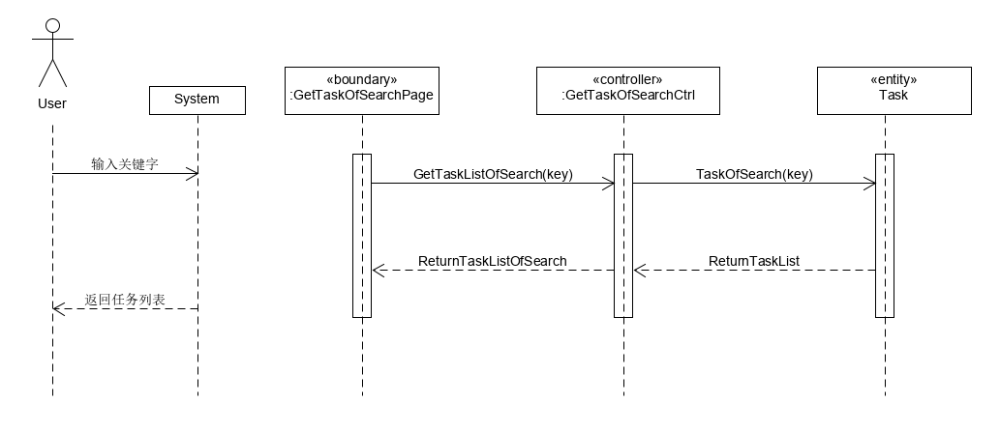
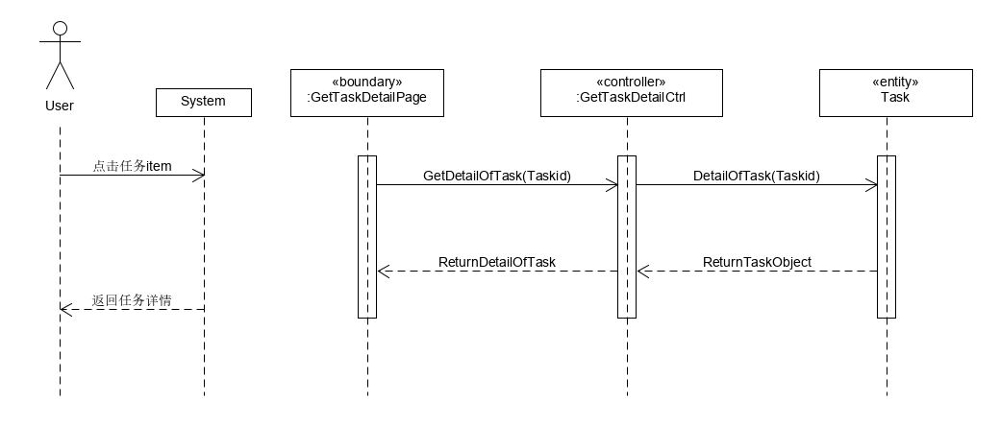
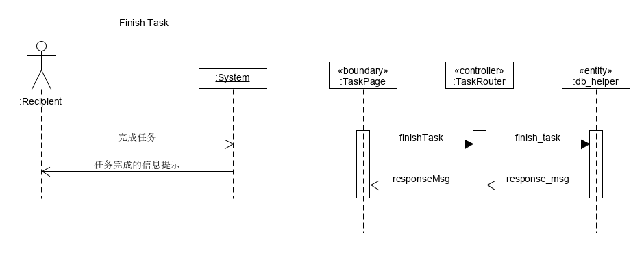
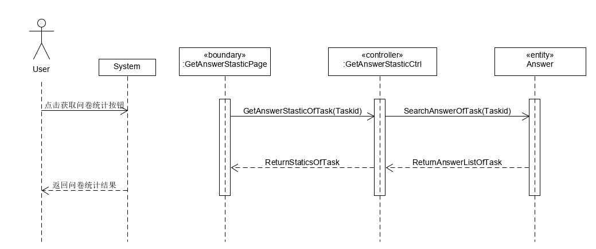

<!-- TOC -->

- [System Sequence Diagram （功能模型）](#system-sequence-diagram-功能模型)
    - [基本功能](#基本功能)
    - [系统顺序图](#系统顺序图)
        - [发布任务（多类型）](#发布任务多类型)
        - [获取与浏览任务列表](#获取与浏览任务列表)
        - [查看任务详细信息](#查看任务详细信息)
        - [领取任务](#领取任务)
        - [完成任务（提交验证信息）](#完成任务提交验证信息)
        - [查看与统计问卷详情](#查看与统计问卷详情)

<!-- /TOC -->

# System Sequence Diagram （功能模型）

根据我们的[用例分析](https://sysu-team1.github.io/Dashboard/06-01-usecase-diagram-and-uml-activity-diagram)

## 基本功能

1. 发布任务（多类型）
2. 获取与浏览任务列表
3. 查看任务详细信息
4. 领取任务
5. 完成任务（提交验证信息）
6. 查看与统计问卷详情

## 系统顺序图

### 发布任务（多类型）

### 获取与浏览任务列表

### 查看任务详细信息

### 领取任务

### 完成任务（提交验证信息）

### 查看与统计问卷详情
