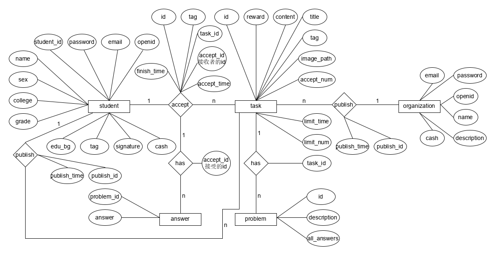

# Database ER Model

## 1. ER模型



## 2. 关系模型

* 任务发布者 : 任务 = 1 : N
    * 任务发布者(<strong>id</strong>, email, password, name, description, cash)
    * 任务(<strong>id</strong>, tag, title, content, limit_time, limit_num, accept_num, image_path, reward)
    * 发布(<strong>publish_id</strong>): 因为一个任务只能有一个发布者，所以其实这个发布是嵌入到任务里面的，已下<strong>可以一对一的都整合为一个表</strong>了。
* 任务接受者 : 接受 = 1 : N
    * 任务接受者(<strong>id</strong>, email, password, name, signature, cash, tag, edu_bg, college, grade, sex)
    * 任务(<strong>id</strong>, <strong>publish_id</strong>, tag, title, content, limit_time, limit_num, accept_num, image_path, reward)
    * 接受(<strong>id</strong>, task_id, 接受者id: accept_id, accept_time, finish_time, tag)
* 任务 : 接受 = 1 : N
    * 任务(<strong>id</strong>, <strong>publish_id</strong>, tag, title, content, limit_time, limit_num, accept_num, image_path, reward)
    * 接受描述(<strong>id</strong>, accept_time, finish_time, tag)
    * 接受(<strong>接受描述的id: accept_desc_id</strong>, <strong>task_id</strong>, <strong>接受者id: accept_id</strong>)
* 任务 : 问题 = 1 : N
    * 任务(<strong>id</strong>, <strong>publish_id</strong>, tag, title, content, limit_time, limit_num, accept_num, image_path, reward)
    * 问题(<strong>id</strong>, description, all_answers)
    * has(<strong>problem_id</strong>, <strong>task_id</strong>)
* 接受 : 回复 = 1 : N
    * 接受(<strong>id</strong>, task_id, 接受者id: accept_id, accept_time, finish_time, tag)
    * 回复(<strong>problem_id</strong>, answer)
    * has(<strong>接受的id(不是接受者): accept_id</strong>, <strong>problem_id</strong>)

## 3. 数据库物理模型

```txt
+------------+----------------------------------+------+-----+---------+----------------+
| Field      | Type                             | Null | Key | Default | Extra          |
+------------+----------------------------------+------+-----+---------+----------------+
| openid     | int(11)                          | NO   | PRI | NULL    | auto_increment |
| email      | varchar(40)                      | NO   |     | NULL    |                |
| password   | varchar(20)                      | NO   |     | NULL    |                |
| student_id | varchar(10)                      | NO   |     |         |                |
| name       | varchar(100)                     | YES  |     |         |                |
| sex        | enum('未知','男','女')           | YES  |     | 未知    |                |
| collage    | varchar(20)                      | YES  |     |         |                |
| grade      | int(11)                          | NO   |     | 2016    |                |
| edu_bg     | enum('本科','硕士','博士')       | YES  |     | 本科    |                |
| tag        | varchar(100)                     | YES  | MUL |         |                |
| signature  | varchar(300)                     | YES  |     |         |                |
| cash       | int(11)                          | YES  |     | 0       |                |
+------------+----------------------------------+------+-----+---------+----------------+
```
```txt
+-------------+--------------+------+-----+---------+----------------+
| Field       | Type         | Null | Key | Default | Extra          |
+-------------+--------------+------+-----+---------+----------------+
| openid      | int(11)      | NO   | PRI | NULL    | auto_increment |
| email       | varchar(40)  | NO   |     | NULL    |                |
| password    | varchar(20)  | NO   |     | NULL    |                |
| name        | varchar(100) | YES  |     |         |                |
| description | varchar(300) | YES  |     |         |                |
| cash        | int(11)      | YES  |     | 0       |                |
+-------------+--------------+------+-----+---------+----------------+
```
```txt
+--------------+--------------+------+-----+---------------------+----------------+
| Field        | Type         | Null | Key | Default             | Extra          |
+--------------+--------------+------+-----+---------------------+----------------+
| id           | int(11)      | NO   | PRI | NULL                | auto_increment |
| publish_id   | int(11)      | NO   | MUL | NULL                |                |
| publish_time | timestamp    | YES  |     | CURRENT_TIMESTAMP   |                |
| limit_time   | timestamp    | YES  |     | 2000-01-01 00:00:00 |                |
| limit_num    | int(11)      | YES  |     | -1                  |                |
| accept_num   | int(11)      | YES  |     | 0                   |                |
| title        | varchar(50)  | NO   | MUL | NULL                |                |
| content      | varchar(300) | NO   |     | NULL                |                |
| tag          | varchar(30)  | YES  | MUL | NULL                |                |
| image_path   | varchar(100) | YES  |     | NULL                |                |
| reward       | int(11)      | YES  |     | 0                   |                |
+--------------+--------------+------+-----+---------------------+----------------+
```
```txt
+-------------+-------------+------+-----+---------------------+----------------+
| Field       | Type        | Null | Key | Default             | Extra          |
+-------------+-------------+------+-----+---------------------+----------------+
| id          | int(11)     | NO   | PRI | NULL                | auto_increment |
| tag         | varchar(30) | YES  |     | NULL                |                |
| accept_id   | int(11)     | NO   | MUL | NULL                |                |
| task_id     | int(11)     | NO   | MUL | NULL                |                |
| accept_time | timestamp   | YES  |     | CURRENT_TIMESTAMP   |                |
| finish_time | timestamp   | YES  |     | 2000-01-01 00:00:00 |                |
+-------------+-------------+------+-----+---------------------+----------------+
```
```txt
+-------------+--------------+------+-----+---------+----------------+
| Field       | Type         | Null | Key | Default | Extra          |
+-------------+--------------+------+-----+---------+----------------+
| id          | int(11)      | NO   | PRI | NULL    | auto_increment |
| task_id     | int(11)      | NO   | MUL | NULL    |                |
| description | varchar(100) | YES  |     |         |                |
| all_answers | varchar(100) | YES  |     |         |                |
+-------------+--------------+------+-----+---------+----------------+
```
```txt
+------------+---------+------+-----+---------+-------+
| Field      | Type    | Null | Key | Default | Extra |
+------------+---------+------+-----+---------+-------+
| accept_id  | int(11) | NO   | PRI | NULL    |       |
| problem_id | int(11) | NO   | PRI | NULL    |       |
| answer     | int(11) | NO   |     | -1      |       |
+------------+---------+------+-----+---------+-------+
```

```sql
CREATE TABLE `students` (
  `openid` int(11) NOT NULL AUTO_INCREMENT COMMENT '用户的唯一标识符',
  `email` varchar(40) NOT NULL COMMENT '学校邮箱',
  `password` varchar(20) NOT NULL COMMENT '密码',
  `student_id` varchar(10) NOT NULL DEFAULT '' COMMENT '学号',
  `name` varchar(100) DEFAULT '' COMMENT '名称',
  `sex` enum('未知','男','女') DEFAULT '未知' COMMENT '用户性别',
  `collage` varchar(20) DEFAULT '' COMMENT '学院',
  `grade` int(11) NOT NULL DEFAULT '2016' COMMENT '入学年级',
  `edu_bg` enum('本科','硕士','博士') DEFAULT '本科' COMMENT '学历',
  `tag` varchar(100) DEFAULT '' COMMENT '与任务相关的标签',
  `signature` varchar(300) DEFAULT '' COMMENT '用户签名',
  `cash` int(11) DEFAULT '0' COMMENT '拥有的币',
  PRIMARY KEY (`openid`),
  FULLTEXT KEY `stu_tag` (`tag`)
) ENGINE=InnoDB AUTO_INCREMENT=1000000 DEFAULT CHARSET=utf8;

CREATE TABLE `organizations` (
  `openid` int(11) NOT NULL AUTO_INCREMENT COMMENT '组织的唯一标识符',
  `email` varchar(40) NOT NULL COMMENT '学校邮箱',
  `password` varchar(20) NOT NULL COMMENT '密码',
  `name` varchar(100) DEFAULT '' COMMENT '名称',
  `description` varchar(300) DEFAULT '' COMMENT '组织描述',
  `cash` int(11) DEFAULT '0' COMMENT '拥有的币',
  PRIMARY KEY (`openid`)
) ENGINE=InnoDB AUTO_INCREMENT=1 DEFAULT CHARSET=utf8;

CREATE TABLE `tasks` (
  `id` int(11) NOT NULL AUTO_INCREMENT COMMENT '任务id',
  `publish_id` int(11) NOT NULL COMMENT '发布者id',
  `publish_time` timestamp NULL DEFAULT CURRENT_TIMESTAMP COMMENT '发布时间',
  `limit_time` timestamp NULL DEFAULT '2000-01-01 00:00:00' COMMENT '限时',
  `limit_num` int(11) DEFAULT '-1' COMMENT '任务可接受人数',
  `accept_num` int(11) DEFAULT '0' COMMENT '任务已接受人数',
  `title` varchar(50) NOT NULL COMMENT '发布任务标题',
  `content` varchar(300) NOT NULL COMMENT '发布任务内容',
  `tag` varchar(30) DEFAULT NULL COMMENT '任务tag',
  `image_path` varchar(100) DEFAULT NULL COMMENT '任务关联图片的路径',
  `reward` int(11) DEFAULT '0' COMMENT '任務报酬',
  PRIMARY KEY (`id`),
  KEY `publish` (`publish_id`,`id`),
  FULLTEXT KEY `task_tag` (`tag`),
  FULLTEXT KEY `task_text` (`title`,`content`)
) ENGINE=InnoDB AUTO_INCREMENT=1 DEFAULT CHARSET=utf8;

CREATE TABLE `accepts` (
  `id` int(11) NOT NULL AUTO_INCREMENT COMMENT '接受id',
  `tag` varchar(30) DEFAULT NULL COMMENT '任务tag',
  `accept_id` int(11) NOT NULL COMMENT '接受者id',
  `task_id` int(11) NOT NULL COMMENT '任务id',
  `accept_time` timestamp NULL DEFAULT CURRENT_TIMESTAMP COMMENT '接受时间',
  `finish_time` timestamp NULL DEFAULT '2000-01-01 00:00:00' COMMENT '完成时间',
  PRIMARY KEY (`id`),
  KEY `task` (`task_id`,`finish_time`),
  KEY `accept` (`accept_id`,`finish_time`),
  CONSTRAINT `accepts_ibfk_1` FOREIGN KEY (`accept_id`) REFERENCES `students` (`openid`) ON DELETE CASCADE,
  CONSTRAINT `accepts_ibfk_2` FOREIGN KEY (`task_id`) REFERENCES `tasks` (`id`) ON DELETE CASCADE
) ENGINE=InnoDB AUTO_INCREMENT=1 DEFAULT CHARSET=utf8;

CREATE TABLE `problems` (
  `id` int(11) NOT NULL AUTO_INCREMENT COMMENT '问题id',
  `task_id` int(11) NOT NULL COMMENT '关联的任务的id',
  `description` varchar(100) DEFAULT '' COMMENT '问题描述',
  `all_answers` varchar(100) DEFAULT '' COMMENT '问题答案',
  PRIMARY KEY (`id`),
  KEY `task_id` (`task_id`),
  CONSTRAINT `problems_ibfk_1` FOREIGN KEY (`task_id`) REFERENCES `tasks` (`id`) ON DELETE CASCADE
) ENGINE=InnoDB AUTO_INCREMENT=1 DEFAULT CHARSET=utf8;

CREATE TABLE `answers` (
  `accept_id` int(11) NOT NULL COMMENT '接受id',
  `problem_id` int(11) NOT NULL COMMENT '问题id',
  `answer` int(11) NOT NULL DEFAULT '-1' COMMENT '具体答案的选项',
  PRIMARY KEY (`accept_id`,`problem_id`),
  KEY `problem_index` (`problem_id`),
  CONSTRAINT `answers_ibfk_1` FOREIGN KEY (`accept_id`) REFERENCES `accepts` (`id`) ON DELETE CASCADE,
  CONSTRAINT `answers_ibfk_2` FOREIGN KEY (`problem_id`) REFERENCES `problems` (`id`) ON DELETE CASCADE
) ENGINE=InnoDB DEFAULT CHARSET=utf8;
```