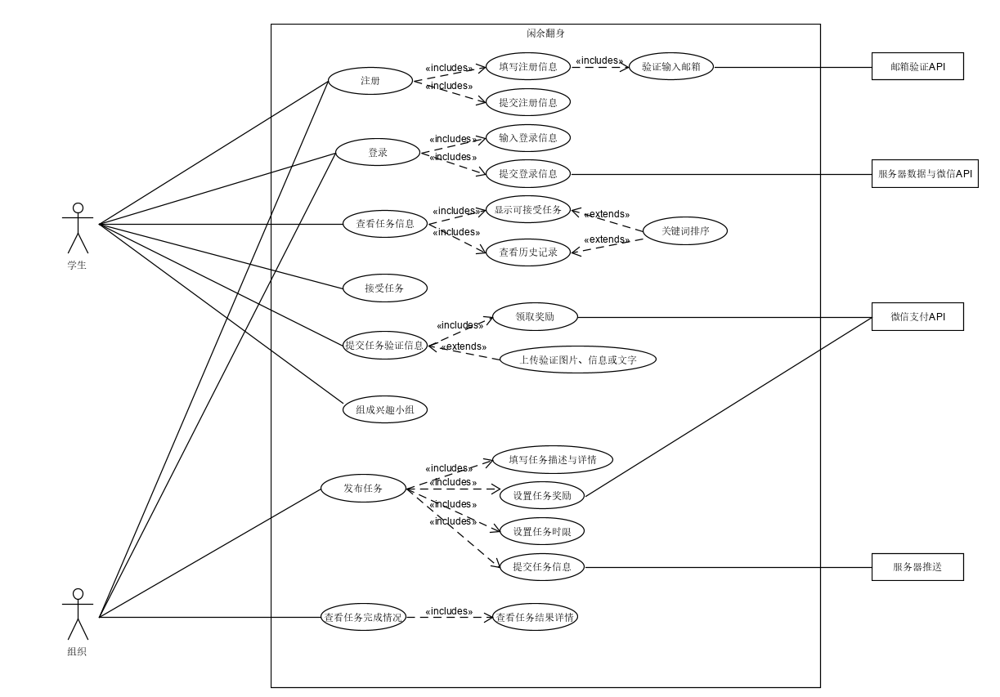
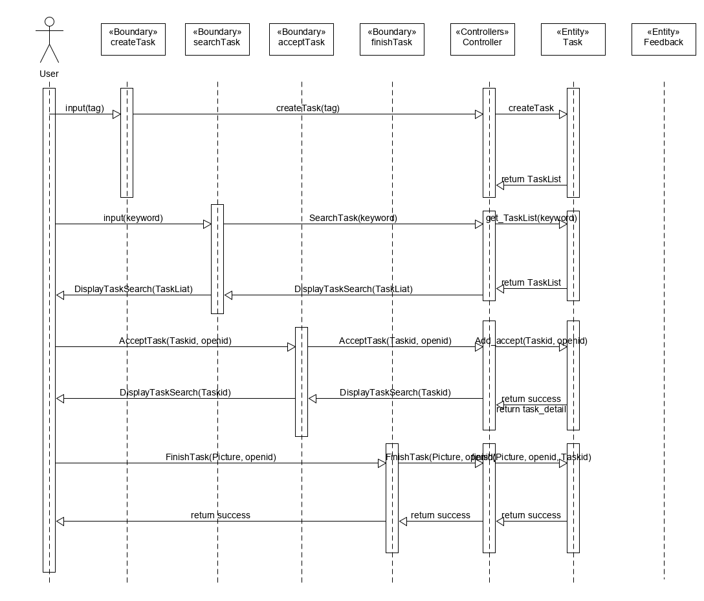
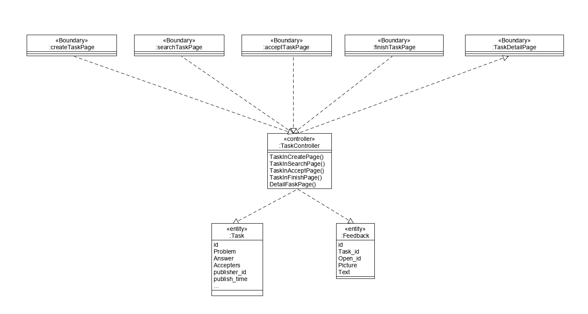

<!-- TOC -->

- [BCE 用例设计](#bce-用例设计)
    - [用例简介](#用例简介)
    - [识别出来的BCE类别有如下这些：](#识别出来的bce类别有如下这些)
    - [时序图](#时序图)
    - [类图](#类图)

<!-- /TOC -->

# BCE 用例设计

## 用例简介

## 识别出来的BCE类别有如下这些：

- Boundary：
  - createTask：主要用于按照类型选择发布任务
  - searchTask：主要用于根据关键词筛选显示的任务
  - acceptTask：主要是用于接受任务
  - finishTask：主要用于完成所接受的任务并提交验证信息以及获得奖励
- Controllers：
  - Controller：一个子系统的一个类，负责处理外部事件，实现控制流
- Entity：
  - User：用户本身
  - Task：任务清单类
  - Feedback：用户完成任务时的提交类

## 时序图

## 类图

