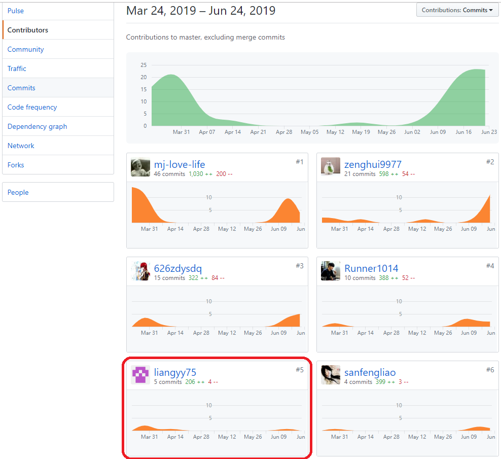
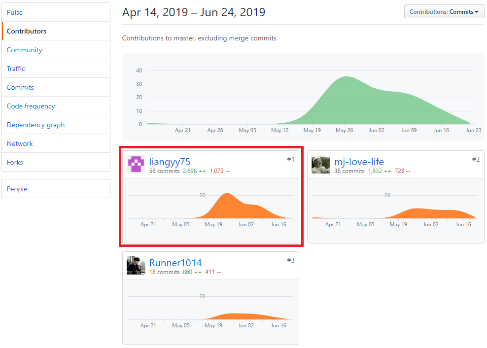

## 个人简洁小结

作为队伍中的后台工程师以及DevOps工程师，我主要的工作是：

* 数据库设计与维护: 在与组员讨论数据库结构与设计后实现和维护后台数据库部分。
* 后台复杂数据逻辑的实现: 编写Service层，后台的页面可直接与Service交互，Service实现了大部分的数据处理相关的部分。
* 后台代码的测试与维护: 编写测试代码，考虑各种极端情况。

## 主要工作清单

### 参与讨论和分析

* 和小组成员一起参与讨论，分析需求并讨论了前台页面的大致组成与后台的大致响应部分。
* 和后台小组成员一起讨论，分析需求并设计和维护了数据库模型。

### 实际开发

* 编写数据库的sql语句，准备了数据库最开始的模型后不断对其完善和维护。
* 选择和学习orm框架，编写了数据层，主要负责数据的增删改查。
* 之后封装了api，参与编写了服务层，组要负责部分数据的逻辑处理，为其他后台交互提供服务。

### 测试运维

* 在实现数据库前，编写sql语句实现和测试了数据库，得到可行的数据库模型。
* 编写服务层时，为每个接口和几乎每个改变都做了测试，确保api不会出错。

## PSP2.1表格

PSP2.1 | Personal Software Process Stages | 预估耗时(%) | 实际耗时(%)
:-|:-|:-|:-
**Planning** | 计划 | 10 | 8
--Estimate | 估计这个任务需要多少时间 | 10 | 8
**Development** | 开发 | 80 | 85
--Analysis | 需求分析 (包括学习新技术) | 14 | 14
--Design Spec | 生成设计文档 | 5 | 7
--Design Review | 设计复审 (和同事审核设计文档) | 5 | 7
--Coding Standard | 代码规范 (为目前的开发制定合适的规范) | 3 | 2
--Design | 具体设计 | 5 | 5
--Coding | 具体编码 | 30 | 31
--Code Review | 代码复审 | 8 | 7
--Test | 测试（自我测试，修改代码，提交修改） | 10 | 12
**Reporting** | 报告 | 10 | 7
--Test Report | 测试报告 | 4 | 3
--Size Measurement | 计算工作量 | 1 | 1
--Postmortem & Process Improvement Plan | 事后总结, 并提出过程改进计划 | 5 | 3
**all** | 合计 | 100 | 100

## 工作清单

### 最得意

根据需求构建了基本的后台数据库部分的框架以及编写了足够多的测试代码为其维护。 
设计了服务层，封装了数据处理的api，其余后台部分只要调用服务层即可。 

### 有价值

足够早的完成了数据库的基础部分，保证没有让进度拖延下去。

### 有苦劳

flask-sqlalchemy这一框架与flask的各种兼容问题，以及后期各种需求更改而导致的服务层变更。

## 在项目相关仓库中的贡献

## 个人博客清单

* [MySQL常用指令(粗制滥造版)](https://blog.csdn.net/m0_37782473/article/details/93419468)
* [Python Flask 快速入门](https://blog.csdn.net/m0_37782473/article/details/93420295)
* [Python flaskalchemy 笔记(极致简化版)](https://blog.csdn.net/m0_37782473/article/details/93421168)

## 特别致谢

* 626zdysdq 感谢多鱼同学作为UI设计师为前端UI部分做出的贡献，还感谢他编写的诸多文档。
* sanfengliao 感谢三锋同学为整体性框架提供的建议以及为前端做出的贡献。
* zenghui9977 感谢大佬把控住项目进度，为整个项目做出的卓越贡献，以及他编写和设计前端的贡献。
* Runner1014 感谢志勇同学为各种文档和后台任务问卷部分等做出的卓越贡献，以及为发现和纠正我的bug而做出的贡献。
* mj-love-life 感谢马佳同学督促我们而贡献的那份力以及其余后台部分做出的卓越贡献。
