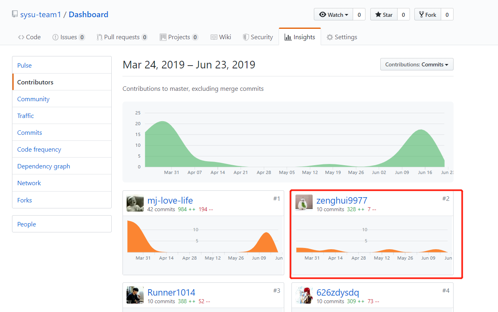

# 16341002-zengh Final Report

## **简短的课程学习自我总结**

作为团队的的js工程师以及架构师,我主要的工作是

* 开发微信小程序
    
    * UI界面的设计： 如界面活动流程，界面的风格
    * UI界面的实现： 利用vscode进行编程
    * UI界面与后端的通信 ： 封装对应的api接口
## **管理**

* 集合人员，成为成员合理分配角色，让前端与后端相对分离，具体的参考内容[Team Profile](https://github.com/sysu-team1/Dashboard/blob/gh-pages/02-team-profile.md)
* 控制项目的进度，保证项目持续进行，参考[项目看板](https://github.com/orgs/sysu-team1/projects)
## **分析**

* 分析项目的前景，以及需要达成的目标，包括多人接收任务的处理情况。
* 组织进行小组会议，讨论和检查项目进度，并指定下一个开发周期的目标和进度。
## **设计**

* 小组讨论探讨UI设计以及对应得方案，按照UI进行相应的编程。
## **开发**

* 使用wepy组件化框架和小程序IDE开发小程序前端界面
* 利用wx原生部件实现对小程序外部接口的连接
* 利用wepy实现前端与后端的连接
## **PSP2.1表格**

||Personal Software Process Stages|Time(%)|
|:-:|:-:|:-:|
|**Planning**|计划|8|
|--Estimate|预估计划进行的时间|8|
|**Development**|开发|85|
|--Analysis|需求分析 (包括学习新技术)|15|
|--Design Spec|生成设计文档|5|
|--Design Review|设计复审 (和同事审核设计文档))|3|
|--Coding Standard|代码规范 (为目前的开发制定合适的规范)|3|
|--Design|确定具体设计|2|
|--Coding|编码|40|
|--Code Review|代码复审|2|
|--Test|测试|15|
|**Report**|报告|7|
|--Test Report|测试报告|15|
|--Work Measurement|计算工作量|15|
|--Postmortem & Process Improvement Plan|总结|15|
## **最得意/或有价值/或有苦劳的工作清单**

* 最得意

分析需求，构建基本的UI框架与小程序的框架，与组员一起提出对应小程序的创新点，参与小程序界面的设计。

在UI设计中，绘制和封装了card控件，以及问卷的问题控件。

登录注册前端的完成，自定义了获取二维码验证的按钮样式以及对应的逻辑。
* 最有价值

保证团队持续有效的参与项目，定期举行了小组会议，讨论小组的项目的进展。
* 最有苦劳

wepy框架的学习以及踩坑，让团队在开发过程中避免了很多环境安装以及开发过程中的问题。
## **个人GIT总结**

## **个人博客清单**

* [微信小程序wepy生命周期详解](https://blog.csdn.net/qq_36304596/article/details/93399480)

* [微信小程序框架快速入门](https://blog.csdn.net/qq_36304596/article/details/93379104)

* [微信小程序开发wepy连接服务器](https://blog.csdn.net/qq_36304596/article/details/93380481)

* [微信小程序wepy自定义card控件封装](https://blog.csdn.net/qq_36304596/article/details/93383821)

* [Docker命令集合](https://blog.csdn.net/qq_36304596/article/details/93385161)
## **特别致谢**

* 626zdysdq 感谢多鱼同学各种文档的贡献，以及对整个项目UI的贡献
* liangyy75 感谢大佬后台的支持，重要API的贡献，重要函数的贡献
* sanfengliao 感谢大佬在遇到bug时的sao操作
* Runner1014 感谢志勇大佬后台各个问题的解决与实现
* mj-love-life 感谢大佬在服务器部署以及前后端连接中做出的重要贡献