# 小组总结

## **小组分工**

| 成员ID | 学号 | 姓名 |工作 |
| :------: | :------: | :------: | :------ |
| [626zdysdq](https://github.com/626zdysdq) | 16340314 | ZDY |- 项目经理  - UI设计师|
| [liangyy75](https://github.com/liangyy75) | 16340134 | LYY | -后台工程师:负责后台开发建设，如处理数据和响应前台 - DevOps工程师:负责小程序环境部署 |
| [sanfengliao](https://github.com/sanfengliao) | 16340136 | LSF | -全栈工程师 - 系统架构师|
| [Runner1014](https://github.com/Runner1014) | 16340137 | LZY | - 后台工程师  - QA工程师|
| [zenghui9977](https://github.com/zenghui9977) | 16341002 | ZH | - js工程师  - 架构师 |
| [mj-love-life](https://github.com/mj-love-life) | 16340166 | MJ | - 产品经理: 负责产品的需求分析与功能设计以及编写文档 - python工程师:负责后台开发 |

## **团队成员自我总结**

> `16341002 @zengh9977`

在本次的项目中，主要负责微信小程序前端的开发以及架构的设计。在这次的项目中，很好的实践了系统开发应用的理论，并且也学习了微信小程序开发的一些技巧和实现。认识到了设计和分析在应用开发中的重要性。意识到了良好的设计决定了整个项目。

在项目的组织过程中，发现了会议在整个项目进程中的重要性，开会一起写代码是一件很不错的事情，能凑在一起写代码，真实能提高对应的工作效率，虽然有的时候，聚在一起写代码是集中力量写bug，但是写完bug会发现写bug的效率也是出奇的高的。

在项目中，做了很多，忙来忙去但是最后却发现，忙的全是bug，出奇的意识到，合理的时间安排和计划安排的重要性，项目刚刚开始的时候，每天coding三至四小时，结果却得到一个不太有用的控件，在小组的讨论计划之后，画出对应的流程图，设计图，发现code只是将想法以代码的形式输入到电脑中，不会有那么多没头绪和bug。计划真的很重要。以及对应的开发知识一定要掌握

这次项目其实也是第一次团队合作完成一个应用，在团队开发中，最重要的就是交流和协调。不然项目可能不能按时完成，中间因为不协调出现的意外太多了。

最后要感谢一下组里的各位大佬，致敬在后端默默改我们需求的大佬，感激在前端默默挖坑的我们。

> `16340134 @liangyy75`

在本次项目中主要负责后端数据库的设计、开发与维护，并在封装api时提供了很多可供其他后端调用的方法和里面混有的bug。我这一块其实还是简单的，不用考虑UI，不用考虑与前台的交互，只要一个又一个的方法就行了，而封装出来的服务层也确实很有用，虽然在python中的封装感觉好像只是一种规范，想调用时随便就能调用。但这样的编程方式也确实加深了我对分层模式的理解。而且也学到了很多知识，如Python的一些库、实用的编程规范。

另外就是这次团队合作，其实之前也有团队合作，但是基本都是一个端，或者说是一人负责一个端，在本端中没有与其他人的沟通交流，而这次却只是负责一个模块了，负责数据库层，因为设计架构的关系，只需要与其余两位后台人员交流即可，就有一种新奇感，感觉到团队合作的力量，尽管还是有很多因为沟通不及时或者是交流不够而导致的不协调、代码的bug，但是开发效率依然是大大增强了吧。

最后还得感谢一下组里的各位大佬队友，没有他们，我的bug是不能及时的被发现和修补的。也希望我提供的api(bug)能符合他们的需求。

> `16340314 @626zdysdq`

在本次项目中，我主要负责页面的UI设计，迭代过程的任务分配、部分页面的实现以及一些文档的完善和补充。在这次项目开发的过程中，我收获最大的地方在于对一个软件的开发过程有了直观的认识，特别对前端的开发过程。由于我主要负责的是UI的设计，所以我主要说一下我从这次实践中感受到的UI设计在项目中的作用。

首先，我觉得一个美观的UI可以提高一个软件的逼格，吸引更多的人来使用。从第一次开会，到后面陆陆续续的改进过程，我们的设计风格前前后后改了挺多次。我们在测试的时候发现，由于后端并不直接反应给用户，如果一个软件的UI很简陋，那么用户会下意识的感觉这个软件是不安全不好用的。

其次，在UI设计上的很多细节会决定用户在使用软件过程中的满意度。例如按钮的位置，按钮的大小，以及页面更新的方式等都会决定用户愿不愿意继续使用这款软件。所以前端的开发并不能单纯的考虑实现功能，还需要从用户的角度出发考虑怎么才能让用户用得明白，用的方便。这也是一个团队中UI设计的主要的任务。

当然除了项目开发上的学习之外，在团队合作上也有学到了很多东西。作为一个瑟瑟发抖的菜鸡，在被小组的其他大佬带飞的同时也发现，在一个开发团体中，必须要有一个监工的存在，比如我们小组的小灰灰，他需要负责督促团队的成员按时按进度完成分配的任务，而不是等到了ddl再仓促的完工。而且小组一起打代码确实是一个确保小组有效沟通的好方法。在刚开始的开发过程中，我们都是各自在做各自的任务，缺乏交流使得我们在测试的时候发现，有很多的bug都是因为前后端的不协调导致的。而后来我们每周会挑一个时间，聚在一起打一晚上的代码，在这段时间里我们遇到问题，或者遇到需求时，可以直接进行面对面对的沟通，保证项目前后端信息传递的统一性。

最后特别鸣谢各位大佬能不嫌弃我这个代码菜鸡，带我完成了这次项目。

> `16340166 @mj-love-life`

在整个学期课程的学习同时，能够将课程上的学习的设计与分析的技巧运用在项目中，使得学以致用并且学习的知识更加牢固。同时也认识到了系统分析与设计在项目实现过程中的重要意义，在以往的团队项目中，都没有系统的需求分析与设计，而是按照自己的思路完成的，所以在与其他队员的协作中总是会遇到意见不和以及完成的项目不尽人意。而老师在课程上所讲授的软件工程相关的专业技术和规范，以及使用UML图来使得设计更为直观生动，让我们的开发的思路更为清晰直观，终生受益。

作为一个产品经理以及python工程师，在早期的项目需求分析与设计的时候，在其他队友的帮助下，清晰地定位好了产品的需求，使得队伍的更有了方向感。同时在项目的进展的同时为项目提出新的需求，这里要万分感谢组长兼前端组长`@zengh9977`以及后端组长`liangyy75`两个大佬每次改需求的时候的耐心，哈哈哈，能够宽恕我的脾气暴躁，以及耐心并且十全十美，竭尽全力地完成需求。

还有就是每天替组长在群里面催人改bug，每次踏进别人宿舍第一句就是“你今天contribute了吗”，跟传销没什么区别了。在整个项目过程中，还是会遇到前后不一致的问题，以及接口等问题，但是组内的人都积极的交流并协调好了。虽然有一些需求最后没能够实现，但是整个项目最后在各位大佬的配合之下还是很不错的。感谢各位大佬在每个紧急情况的carry。

> 16340136 @liaosanfeng

本次项目主要负责前端方面的开发，我们这次使用的是微信小程序作为前端技术栈，在此之前看过小程序的文档，学过一段时间，但是这次项目用的是wepy这个小程序框架，语法上和小程序原生相似，还是有一些不同的，开发过程中难免会出现不少的bug，好在都顺利解决了。

由于是前端开发，自然设计的UI的设计，作为一名直男，审美程度还是存在很大的问题的，所以在开发初期无从那个下手，不知道该如何去写页面，好在我们有优秀的UI设计师`626zdysdq`和负责任的组长`zenghui9977`给予大力的帮助，使得页面的编写能够顺利的进行

作为项目的架构师(假的)，在开发时提出了一些奇怪的接口要求，感谢后台的三位大佬`liangyy75`，`Runner1014`，`mj-love-life`对接口的实现，使得我们的项目看起来有点东西了，还有感谢`mj-love-life`对我们的监督和要求，让我们能够顺利的完成开发

## **PSP-2.1 统计表**

> `16341002 @zengh9977`

|PSP阶段|耗时|
|:-:|:-:|
|**计划**|3|
|.计划任务完成时间|3|
|**开发**|143|
|.需求分析与需求文档|6|
|.生成设计文件|2|
|.设计review|12|
|.代码规范以及代码规范文档|4|
|.具体设计|1|
|.具体编码|114|
|.代码复审|1|
|.测试|3|
|**报告**|5|
|.测试报告|1|
|.计算工作量|2|
|.总结与改进|2|
|**合计**|151|

> `16340166 @mj-love-life`

|          PSP阶段          | 耗时 |
| :-----------------------: | :--: |
|         **计划**          |  12  |
|     .计划任务完成时间     |  12  |
|         **开发**          |  90  |
|    .需求分析与需求文档    |  12  |
|       .生成设计文件       |  6   |
|        .设计review        | 7.2  |
| .代码规范以及代码规范文档 | 2.4  |
|         .具体设计         |  12  |
|         .具体编码         | 32.4 |
|         .代码复审         |  6   |
|           .测试           |  12  |
|         **报告**          |  18  |
|         .测试报告         | 2.4  |
|        .计算工作量        | 2.4  |
|        .总结与改进        | 13.2 |
|         **合计**          | 120  |

> `16340134 @liangyy75`

PSP2.1 | 实际耗时(h)
:-|:-
**Planning** | 9.6
--Estimate | 9.6
**Development** | 102
--Analysis | 16.8
--Design Spec | 8.4
--Design Review | 8.4
--Coding Standard | 2.4
--Design | 6
--Coding | 37.2
--Code Review | 8.4
--Test | 14.4
**Reporting** | 8.4
--Test Report | 3.6
--Size Measurement | 1.2
--Postmortem & Process Improvement Plan | 3.6
**all** | 120

> 16340136 @sanfengliao

|PSP阶段|耗时|
|:-:|:-:|
|**计划**|3|
|.计划任务完成时间|3|
|**开发**|115|
|.需求分析与需求文档|5|
|.生成设计文件|3|
|.设计review|8|
|.代码规范以及代码规范文档|4|
|.具体设计|1|
|.具体编码|90|
|.代码复审|1|
|.测试|3|
|**报告**|5|
|.测试报告|1|
|.计算工作量|2|
|.总结与改进|2|
|**合计**|123|

## GIT统计报告

> `16341002 @zenghui9977`

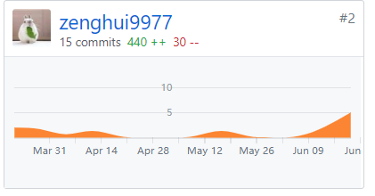
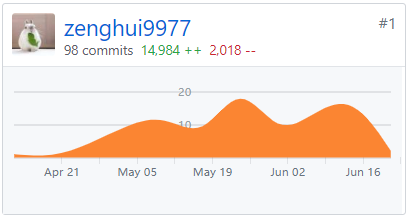

> `16340314 @626zdysdq`

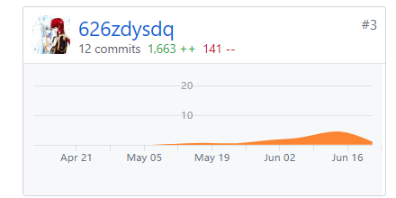
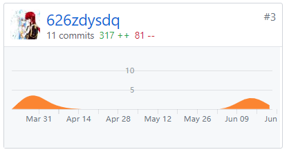

> `16340166 @mj-love-life`

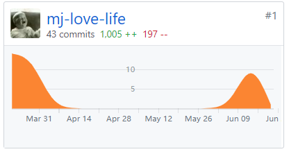
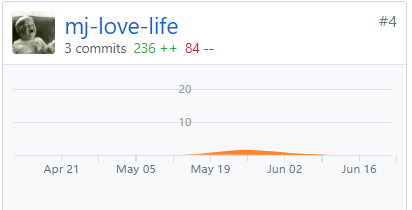
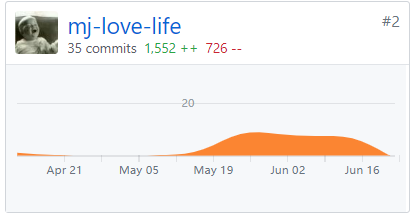

> `16340134 @liangyy75`

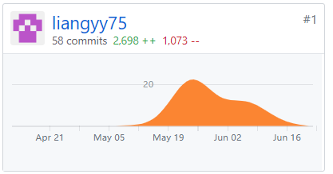
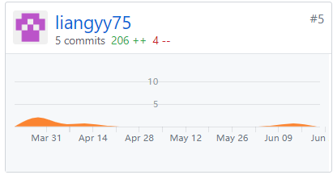

> `16340136 @sanfengliao`

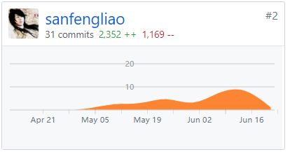
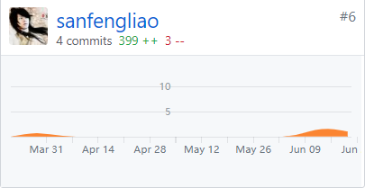

> `16340137 @Runner1014`

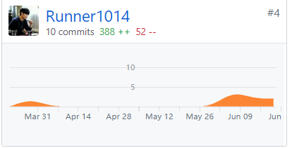

## 分工与贡献

小组分工

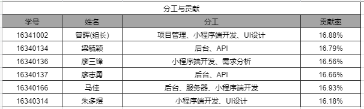

小组贡献

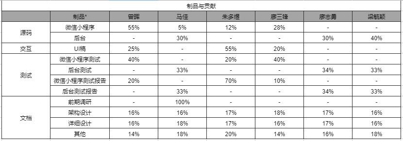