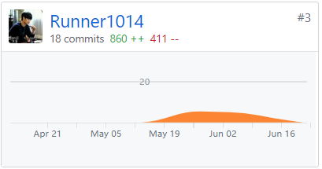

# 小组总结

## **小组分工**

| 成员ID | 学号 | 姓名 |工作 |
| :------: | :------: | :------: | :------ |
| [626zdysdq](https://github.com/626zdysdq) | 16340314 | ZDY |- 项目经理  - UI设计师|
| [liangyy75](https://github.com/liangyy75) | 16340134 | LYY | -后台工程师:负责后台开发建设，如处理数据和响应前台 - DevOps工程师:负责小程序环境部署 |
| [sanfengliao](https://github.com/sanfengliao) | 16340136 | LSF | -全栈工程师 - 系统架构师|
| [Runner1014](https://github.com/Runner1014) | 16340137 | LZY | - 后台工程师  - QA工程师|
| [zenghui9977](https://github.com/zenghui9977) | 16341002 | ZH | - js工程师  - 架构师 |
| [mj-love-life](https://github.com/mj-love-life) | 16340166 | MJ | - 产品经理: 负责产品的需求分析与功能设计以及编写文档 - python工程师:负责后台开发 |

## **团队成员自我总结**

> `16341002 @zengh9977`

在本次的项目中，主要负责微信小程序前端的开发以及架构的设计。在这次的项目中，很好的实践了系统开发应用的理论，并且也学习了微信小程序开发的一些技巧和实现。认识到了设计和分析在应用开发中的重要性。意识到了良好的设计决定了整个项目。

在项目的组织过程中，发现了会议在整个项目进程中的重要性，开会一起写代码是一件很不错的事情，能凑在一起写代码，真实能提高对应的工作效率，虽然有的时候，聚在一起写代码是集中力量写bug，但是写完bug会发现写bug的效率也是出奇的高的。

在项目中，做了很多，忙来忙去但是最后却发现，忙的全是bug，出奇的意识到，合理的时间安排和计划安排的重要性，项目刚刚开始的时候，每天coding三至四小时，结果却得到一个不太有用的控件，在小组的讨论计划之后，画出对应的流程图，设计图，发现code只是将想法以代码的形式输入到电脑中，不会有那么多没头绪和bug。计划真的很重要。以及对应的开发知识一定要掌握

这次项目其实也是第一次团队合作完成一个应用，在团队开发中，最重要的就是交流和协调。不然项目可能不能按时完成，中间因为不协调出现的意外太多了。

最后要感谢一下组里的各位大佬，致敬在后端默默改我们需求的大佬，感激在前端默默挖坑的我们。

> `16340166 @mj-love-life`

在整个学期课程的学习同时，能够将课程上的学习的设计与分析的技巧运用在项目中，使得学以致用并且学习的知识更加牢固。同时也认识到了系统分析与设计在项目实现过程中的重要意义，在以往的团队项目中，都没有系统的需求分析与设计，而是按照自己的思路完成的，所以在与其他队员的协作中总是会遇到意见不和以及完成的项目不尽人意。而老师在课程上所讲授的软件工程相关的专业技术和规范，以及使用UML图来使得设计更为直观生动，让我们的开发的思路更为清晰直观，终生受益。

作为一个产品经理以及python工程师，在早期的项目需求分析与设计的时候，在其他队友的帮助下，清晰地定位好了产品的需求，使得队伍的更有了方向感。同时在项目的进展的同时为项目提出新的需求，这里要万分感谢组长兼前端组长`@zengh9977`以及后端组长`liangyy75`两个大佬每次改需求的时候的耐心，哈哈哈，能够宽恕我的脾气暴躁，以及耐心并且十全十美，竭尽全力地完成需求。

还有就是每天替组长在群里面催人改bug，每次踏进别人宿舍第一句就是“你今天contribute了吗”，跟传销没什么区别了。在整个项目过程中，还是会遇到前后不一致的问题，以及接口等问题，但是组内的人都积极的交流并协调好了。虽然有一些需求最后没能够实现，但是整个项目最后在各位大佬的配合之下还是很不错的。感谢各位大佬在每个紧急情况的carry。

## **PSP-2.1 统计表**

> `16341002 @zengh9977`

|PSP阶段|耗时|
|:-:|:-:|
|**计划**|3|
|.计划任务完成时间|3|
|**开发**|143|
|.需求分析与需求文档|6|
|.生成设计文件|2|
|.设计review|12|
|.代码规范以及代码规范文档|4|
|.具体设计|1|
|.具体编码|114|
|.代码复审|1|
|.测试|3|
|**报告**|5|
|.测试报告|1|
|.计算工作量|2|
|.总结与改进|2|
|**合计**|151|

> `16340166 @mj-love-life`

|          PSP阶段          | 耗时 |
| :-----------------------: | :--: |
|         **计划**          |  12  |
|     .计划任务完成时间     |  12  |
|         **开发**          |  90  |
|    .需求分析与需求文档    |  12  |
|       .生成设计文件       |  6   |
|        .设计review        | 7.2  |
| .代码规范以及代码规范文档 | 2.4  |
|         .具体设计         |  12  |
|         .具体编码         | 32.4 |
|         .代码复审         |  6   |
|           .测试           |  12  |
|         **报告**          |  18  |
|         .测试报告         | 2.4  |
|        .计算工作量        | 2.4  |
|        .总结与改进        | 13.2 |
|         **合计**          | 120  |

## GIT统计报告

> `16341002 @zenghui9977`

> `16340314 @626zdysdq`

> `16340166 @mj-love-life`

> `16340134 @liangyy75`

> `16340136 @sanfengliao`

> `16340137 @Runner1014`

## 分工与贡献

小组分工

小组贡献

